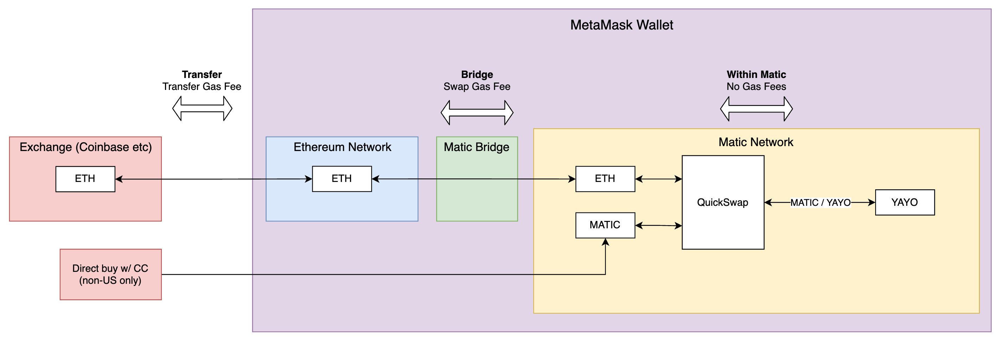

# How to Buy $YAYO

$YAYO is an ERC-20 token on the Matic Network. Follow these steps to buy
$YAYO, or join our [Telegram](#TODO) if you need assistance.

## 1. Create a MetaMask wallet

MetaMask is a popular wallet for managing ERC-20 tokens. Download the
[browser extension](https://metamask.io/download.html) or the
[iPhone](https://apps.apple.com/us/app/metamask/id1438144202) or
[Android](https://play.google.com/store/apps/details?id=io.metamask) apps.

## 2. Send $MATIC to MetaMask

Buy $ETH or $MATIC on any of the major exchanges such as Coinbase, Binance or
FTX, then transfer/withdraw the funds to your wallet address on MetaMask.

## 3. Connect to the Matic network

If you are on browser, visit [QuickSwap](https://quickswap.exchange/#/swap)
and hit **Connect to a Wallet**. QuickSwap will add the network automatically.

If you are using MetaMask on iPhone/Android, add the network manually in your
wallet by going to _Settings_, then _Network_, click _Add Network_ and fill in
the following values:

| Field                           | Value                                   |
| ------------------------------- | --------------------------------------- |
| Network Name                    | Matic Network                           |
| Network URL                     | https://rpc-mainnet.maticvigil.com      |
| Chain ID                        | 137                                     |
| _Currency Symbol (optional)_    | MATIC                                   |
| _Block Explorer URL (optional)_ | https://explorer-mainnet.maticvigil.com |
|                                 |                                         |

## 4. Transfer Funds to Matic Network

Visit [Matic Bridge](https://wallet.matic.network/bridge) and transfer funds
from Ethereum to the Matic Network.

## 5. Swap $MATIC for $YAYO

Visit [QuickSwap](https://quickswap.exchange/#/swap), and click
**Connect to a Wallet**.

Enter the amount of $MATIC you would like to convert to $YAYO and you will see
your return. Then click **Swap** to process the transaction.

The purchased $YAYO will now appear in your MetaMask wallet. To sell $YAYO,
simply follow the same steps in reverse.
